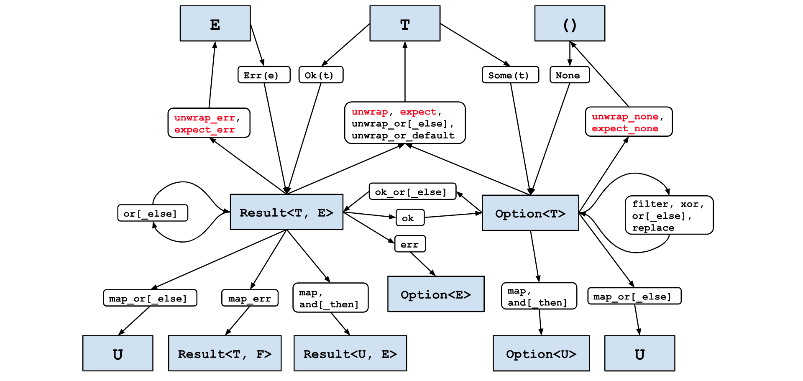

# 条目 3: 避免在Option和Result类型上使用match操作

[条目 1](./Item1.md) 阐述了`enum`的优点，并展示了如何使用`match`表达式强制程序员考虑所有可能性；这一条目探讨了在何种情况下应该避免显式地使用`match`表达式。

[条目 1](./Item1.md) 还介绍了Rust标准库中非常常见的两个`enum`类型：

* `Option<T>`：表示一个值可能存在`Some`，也可能不存在`None`。
* `Result<T, E>`：表示一个操作可能成功`Ok`，也可能失败`Err`。

对于这些特定的`enum`类型来说，显示地使用`match`通常会导致代码更加的冗长，而且这也不符合Rust的惯用风格。

一种情况，当我们只关心值存在的场景，而想要直接忽略值不存在的场景，如下的代码：

```rust
    struct S {
        field: Option<i32>,
    }

    let s = S { field: Some(42) };
    match &s.field {
        Some(i) => println!("field is {}", i),
        None => {}
    }
```

对于这种场景来说，一个`if let`表达式更加的简洁，非常清晰：

```rust
    struct S {
        field: Option<i32>,
    }

    let s = S { field: Some(42) };
    if let Some(i) = &s.field {
        println!("field is {}", i);
    }
```

然而，大多数时候，值的缺失以及相关的错误是程序员必须处理的问题。设计软件应对失败的路径是困难的，而且其中大部分是无法通过语法解决其根本复杂性 -- 具体来说，如果失败我们应该决定接下来需要如何处理。


在某些情况下,正确的决策是执行一种"鸵鸟战术",明确地不处理失败的情况。使用显式的match语句来做这件事将会过于啰嗦:

```rust
    let result = std::fs::File::open("/etc/passwd");
    let f = match result {
        Ok(f) => f,
        Err(_e) => panic!("Failed to open /etc/passwd!"),
    };
```

Option和Result类型提供了`unwrap`和`expect`方法，这两个方法在值存在的情况下返回值，否则会触发panic。这两个方法是`match`的简化版本，`expect`方法允许自定义错误信息，但无论哪种情况,生成的代码都更短更简单 - 错误处理被委托给了 `.unwrap()` 后缀(但仍然存在)。

```rust
    let f = std::fs::File::open("/etc/passwd").unwrap();
```

明确一点:这些辅助函数也是会`panic!`，所以选择使用他们和选择`panic!`（条目 18）是一样的。

然后在很多情况下，正确的错误处理是将错误传递给调用者。这一点在编写库的时候尤为突出，因为该代码可能会在库作者无法预料的各种不同的环境中使用。为了让其他人的工作处理的更加容易一些，优先使用`Resutl`而不是`Option`，及时我们需要在不同的错误类型中进行转换（条目 4）

`Result`类型有 `[#must_use]`属性去强制库的使用者朝着预期的方向努力 -- 如果代码未使用返回的`Result`类型忽略了它，编译器会生成警告：

```shell
warning: unused `Result` that must be used
  --> transform/src/main.rs:32:5
   |
32 |     f.set_len(0); // Truncate the file
   |     ^^^^^^^^^^^^^
   |
   = note: `#[warn(unused_must_use)]` on by default
   = note: this `Result` may be an `Err` variant, which should be handled
```

显示使用 `match`允许一个错误进行传播，但是这里会造成冗余的样板代码（类似Go语言的错误处理方式）

```rust
    pub fn find_user(username: &str) -> Result<UserId, std::io::Error> {
        let f = match std::fs::File::open("/etc/passwd") {
            Ok(f) => f,
            Err(e) => return Err(e),
        };
        // ...
    }
```

减少这会冗余样板代码的关键是Rust的[问号运算符?](https://doc.rust-lang.org/reference/expressions/operator-expr.html#the-question-mark-operator)。这个语法糖使得`Err`和`return Err(...)`表达式变成了一行代码：

```rust
    pub fn find_user(username: &str) -> Result<UserId, std::io::Error> {
        let f = std::fs::File::open("/etc/passwd")?;
        // ...
    }
```

对于Rust新手来说，这种写法有时候会让人不安：问号运算符不太容易一眼就能注意到，因此不太容易注意到代码的实际含义以及作用。然而，即使只有一个简单的字符，类型系统仍然可以很好的工作，确保可以覆盖相关类型的表达[条目 1](./Item1.md). - 这使得程序员可以关注到主线代码，而不用担心错误处理的细节。

甚者，这里相对于显示的方法调用也不会产生额外的代价，而且这些通用函数都会标记为`#[inline]`的方式，生成的代码会和显示的方法调用一样高效。

上述两个因素让你再选择处理`Option`和`Result`类型的时候，更倾向于使用`if let`和`?`运算符，而不是显式的`match`表达式。

在前面的示例中，错误类型是一致的，内部方法和外部方法使用的错误类型都是`std::io::Error`来表示错误，但是这种情况并不常见，一般来说一个函数会从一些子库中积累到不同的错误类型，而这些子库一般都是使用不同的错误类型的。

通常的错误映射转换会被在[条目 4](./Item4.md)中讨论，但是现在，我们就用手动的方式进行转换：

```rust
    pub fn find_user(username: &str) -> Result<UserId, String> {
        let f = match std::fs::File::open("/etc/passwd") {
            Ok(f) => f,
            Err(e) => {
                return Err(format!("Failed to open password file: {:?}", e))
            }
        };
        // ...
    }
```

可以使用`.map_err()`转换显得更加的简洁更加符合Rust的风格。

```rust
    pub fn find_user(username: &str) -> Result<UserId, String> {
        let f = std::fs::File::open("/etc/passwd").map_err(|e| format!("Failed to open password file: {:?}", e))?;
        // ...
    }
```

更好的是，如果外部错误类型可以通过实现`From` trait（条目 5）来从内部类型进行创建，那么编译器就会自动转换类型，无需调用`.map_err()`。

这些方式的转换都是通用的，问号运算符可以说是在Rust转换`Option`和`Result`类型的大杀器，把它可以用到任何需要的地方

标准库提供了大量的转换函数来使得这一件事情变得很容易，详细的转换地图：下面红色的是可能发生`panic!`的方法：



[在线版本方法可点击](https://docs.google.com/drawings/u/0/d/1EOPs0YTONo_FygWbuJGPfikO9Myt5HwtiFUHRuE1JVM/preview?pli=1)

一个比较通用的场景，当在处理引用的时候，上面没有覆盖到。举例，考虑如下结构体：

```rust
    struct InputData {
        payload: Option<Vec<u8>>,
    }
```

这个结构体的方法试图直接通过获取payload的引用去调用一个签名为`(&[u8]) -> Vec<u8>`加密函数，这样会失败：

```rust
    impl InputData {
        fn encrypt(&self) -> Vec<u8> {
            encrypt(&self.payload.unwrap_or(vec![]))
        }
    }
```

```shell
error[E0507]: cannot move out of `self.payload` which is behind a shared reference
  --> transform/src/main.rs:62:22
   |
62 |             encrypt(&self.payload.unwrap_or(vec![]))
   |                      ^^^^^^^^^^^^ move occurs because `self.payload` has type `Option<Vec<u8>>`, which does not implement the `Copy` trait
   |
help: consider borrowing the `Option`'s content
   |
62 |             encrypt(&self.payload.as_ref().unwrap_or(vec![]))
   |                                  +++++++++
```

错误信息准确描述了使代码正常工作所需要的是 Option 上的 as_ref() 方法。该方法将对 Option 的引用转换为一个内部类型引用的 Option: `pub const fn as_ref(&self) -> Option<&T>`

总结：

* 习惯使用`Option`和`Result`类型，优先使用`Result`;
  * 在涉及引用的转换上，使用`.as_ref()`方法;
* 避免显式的`match`表达式，优先使用`if let`和`?`运算符以及转换函数;
* 特别是, 使用它们在`?`运算符的作用下转换成结果类型。